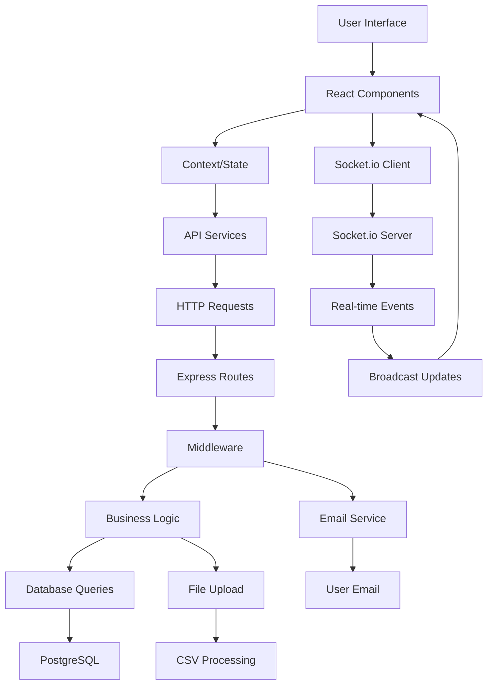
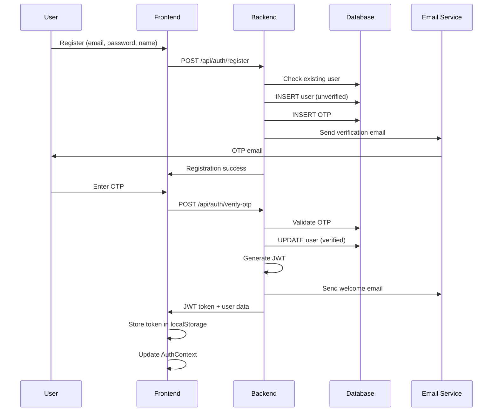
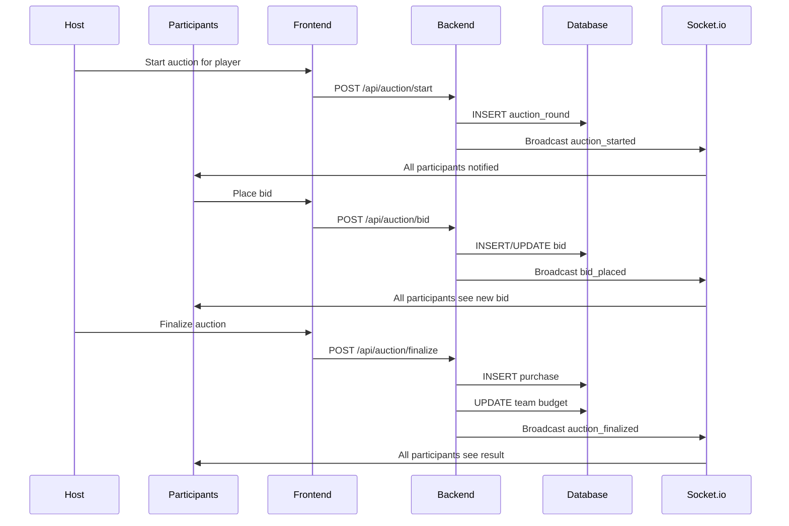

# 🏏 Cricket Auction App - Technical Architecture & File Flow

A comprehensive guide explaining how the tech stack works, data flow, and the role of each file in the cricket auction application.

## 📋 Table of Contents

- [System Architecture Overview](#-system-architecture-overview)
- [Tech Stack Flow](#-tech-stack-flow)
- [Data Flow Diagram](#-data-flow-diagram)
- [Backend File Structure & Flow](#-backend-file-structure--flow)
- [Frontend File Structure & Flow](#-frontend-file-structure--flow)
- [Database Schema & Relationships](#-database-schema--relationships)
- [Real-time Communication Flow](#-real-time-communication-flow)
- [Authentication Flow](#-authentication-flow)
- [Auction Process Flow](#-auction-process-flow)
- [File-by-File Technical Explanation](#-file-by-file-technical-explanation)

---

## 🏗️ System Architecture Overview

```
┌─────────────────────────────────────────────────────────────────┐
│                        CLIENT SIDE (React)                     │
│  ┌─────────────┐  ┌─────────────┐  ┌─────────────┐            │
│  │   Pages     │  │ Components  │  │  Services   │            │
│  │             │  │             │  │             │            │
│  │ • Login     │  │ • Private   │  │ • API       │            │
│  │ • Dashboard │  │   Route     │  │ • Socket    │            │
│  │ • Auction   │  │ • OTP       │  │ • Auth      │            │
│  │ • Teams     │  │ • Bulk      │  │             │            │
│  └─────────────┘  └─────────────┘  └─────────────┘            │
│           │               │               │                   │
│           └───────────────┼───────────────┘                   │
│                           │                                   │
│  ┌─────────────────────────────────────────────────────────┐   │
│  │              Context & State Management                 │   │
│  │              • AuthContext                              │   │
│  │              • Local State (useState)                  │   │
│  │              • Socket State                            │   │
│  └─────────────────────────────────────────────────────────┘   │
└─────────────────────────────────────────────────────────────────┘
                                │
                    HTTP/REST + Socket.io
                                │
┌─────────────────────────────────────────────────────────────────┐
│                        SERVER SIDE (Node.js)                   │
│  ┌─────────────┐  ┌─────────────┐  ┌─────────────┐            │
│  │   Routes    │  │ Middleware  │  │   Socket    │            │
│  │             │  │             │  │             │            │
│  │ • Auth      │  │ • JWT       │  │ • Auction   │            │
│  │ • Tournament│  │ • CORS      │  │   Events    │            │
│  │ • Teams     │  │ • Auth      │  │ • Real-time │            │
│  │ • Players   │  │             │  │   Updates   │            │
│  │ • Auction   │  │             │  │             │            │
│  └─────────────┘  └─────────────┘  └─────────────┘            │
│           │               │               │                   │
│           └───────────────┼───────────────┘                   │
│                           │                                   │
│  ┌─────────────────────────────────────────────────────────┐   │
│  │              Business Logic & Utilities                 │   │
│  │              • Email Service                            │   │
│  │              • File Upload                              │   │
│  │              • Data Validation                          │   │
│  └─────────────────────────────────────────────────────────┘   │
└─────────────────────────────────────────────────────────────────┘
                                │
                            SQL Queries
                                │
┌─────────────────────────────────────────────────────────────────┐
│                        DATABASE (PostgreSQL)                   │
│  ┌─────────────┐  ┌─────────────┐  ┌─────────────┐            │
│  │   Core      │  │  Auction    │  │   Support   │            │
│  │  Tables     │  │   Tables    │  │   Tables    │            │
│  │             │  │             │  │             │            │
│  │ • users     │  │ • auction_  │  │ • email_otps│            │
│  │ • tournaments│  │   rounds    │  │ • team_     │            │
│  │ • teams     │  │ • bids      │  │   members   │            │
│  │ • players   │  │ • purchases │  │ • migrations│            │
│  └─────────────┘  └─────────────┘  └─────────────┘            │
└─────────────────────────────────────────────────────────────────┘
```

---

## 🔄 Tech Stack Flow

### 1. **Request Flow**
```
User Action → React Component → API Service → Express Route → Database → Response
```

### 2. **Real-time Flow**
```
User Action → Socket.io Client → Socket.io Server → Database → Broadcast to All Clients
```

### 3. **Authentication Flow**
```
Login → JWT Generation → Token Storage → Protected Route Access → Token Validation
```

---

## 📊 Data Flow Diagram



---

## 🗂️ Backend File Structure & Flow

### **Core Server Files**

#### `server.js` - Main Application Entry Point
```javascript
// What it does:
// 1. Sets up Express application
// 2. Configures middleware (CORS, JSON parsing)
// 3. Establishes database connection
// 4. Sets up Socket.io server
// 5. Imports and mounts route modules
// 6. Starts HTTP server

// Key responsibilities:
- Environment variable loading
- Database connection pooling
- Socket.io server configuration
- Route mounting and organization
- Server startup and port binding
```

#### `middleware/auth.js` - Authentication Middleware
```javascript
// What it does:
// 1. Validates JWT tokens from request headers
// 2. Extracts user information from tokens
// 3. Attaches user data to request object
// 4. Protects routes from unauthorized access

// Flow:
Request → Extract Token → Verify JWT → Attach User → Next Middleware
```

### **Route Modules**

#### `routes/auth.js` - Authentication Routes
```javascript
// Endpoints and their flow:

// POST /api/auth/register
// Flow: Email Check → Password Hash → User Creation → OTP Generation → Email Send
// Files involved: emailService.js, database

// POST /api/auth/login  
// Flow: Email Lookup → Password Verify → JWT Generation → Token Return
// Files involved: database, JWT library

// POST /api/auth/verify-otp
// Flow: OTP Validation → User Verification → JWT Generation → Welcome Email
// Files involved: emailService.js, database

// POST /api/auth/resend-otp
// Flow: User Check → New OTP → Email Send
// Files involved: emailService.js, database
```

#### `routes/tournaments.js` - Tournament Management
```javascript
// Key endpoints and flow:

// POST /api/tournaments/create
// Flow: Host Validation → Tournament Creation → Team Generation → Code Generation
// Database operations: INSERT tournaments, INSERT teams

// POST /api/tournaments/join
// Flow: Code Validation → User Addition → Team Assignment
// Database operations: SELECT tournaments, INSERT team_members

// GET /api/tournaments/my-tournaments
// Flow: User ID → Tournament Lookup → Hosted Tournaments Return
// Database operations: SELECT tournaments WHERE host_id = user_id
```

#### `routes/teams.js` - Team Management
```javascript
// Key endpoints and flow:

// POST /api/teams/join
// Flow: Team Code Validation → Role Assignment → Member Addition
// Database operations: SELECT teams, INSERT team_members

// GET /api/teams/can-bid/:id
// Flow: Team Check → Budget Check → Permission Check
// Database operations: SELECT teams, SELECT purchases, budget calculation
```

#### `routes/players.js` - Player Management
```javascript
// Key endpoints and flow:

// POST /api/players/add
// Flow: Tournament Validation → Player Creation → Database Insert
// Database operations: INSERT players

// POST /api/players/upload-csv
// Flow: File Upload → CSV Parsing → Bulk Insert → Validation
// Files involved: multer, csv-parser, database

// GET /api/players/tournament/:id
// Flow: Tournament ID → Player Lookup → Status Filter → Return Players
// Database operations: SELECT players WHERE tournament_id = id
```

#### `routes/auction.js` - Auction Logic
```javascript
// Key endpoints and flow:

// POST /api/auction/start
// Flow: Host Check → Player Validation → Auction Creation → Socket Broadcast
// Database operations: INSERT auction_rounds
// Real-time: Socket.io broadcast to tournament room

// POST /api/auction/bid
// Flow: Team Validation → Bid Validation → Highest Bid Check → Database Update
// Database operations: INSERT/UPDATE bids
// Real-time: Socket.io broadcast bid update

// POST /api/auction/finalize
// Flow: Auction Check → Winner Determination → Purchase Creation → Budget Update
// Database operations: INSERT purchases, UPDATE teams, UPDATE players
// Real-time: Socket.io broadcast auction result
```

### **Real-time Communication**

#### `socket/auctionSocket.js` - Socket.io Event Handlers
```javascript
// What it does:
// 1. Authenticates socket connections using JWT
// 2. Manages tournament room memberships
// 3. Handles real-time auction events
// 4. Broadcasts updates to all connected clients

// Event flow:
// Client Events → Server Processing → Database Updates → Broadcast to Room
```

### **Utility Files**

#### `utils/emailService.js` - Email Service
```javascript
// What it does:
// 1. Configures Nodemailer with email credentials
// 2. Sends OTP verification emails
// 3. Sends welcome emails
// 4. Handles email template formatting

// Flow:
// Email Request → Template Generation → SMTP Send → Delivery Confirmation
```

---

## ⚛️ Frontend File Structure & Flow

### **Main Application Files**

#### `src/App.js` - Application Root
```javascript
// What it does:
// 1. Sets up React Router for navigation
// 2. Wraps application with AuthProvider
// 3. Defines all application routes
// 4. Handles route protection

// Flow:
// App Load → Router Setup → AuthProvider → Route Definition → Component Rendering
```

#### `src/index.js` - React Entry Point
```javascript
// What it does:
// 1. Renders the main App component
// 2. Attaches to DOM element
// 3. Sets up React StrictMode

// Flow:
// React Start → DOM Mount → App Render → Component Tree
```

### **State Management**

#### `src/context/AuthContext.js` - Global Authentication State
```javascript
// What it does:
// 1. Manages global authentication state
// 2. Handles login/logout operations
// 3. Persists authentication data
// 4. Provides auth state to all components

// State flow:
// Login → Token Storage → State Update → Component Re-render
// Logout → Token Removal → State Clear → Redirect to Login
```

### **Page Components**

#### `src/pages/Login.js` - Authentication Interface
```javascript
// What it does:
// 1. Renders login form
// 2. Handles form submission
// 3. Manages authentication state
// 4. Redirects on successful login

// Flow:
// Form Input → Validation → API Call → AuthContext Update → Navigation
```

#### `src/pages/Dashboard.js` - Main Dashboard
```javascript
// What it does:
// 1. Displays user's tournaments
// 2. Shows tournament creation options
// 3. Handles tournament joining
// 4. Manages tournament navigation

// Data flow:
// Component Mount → API Calls → State Update → UI Render
```

#### `src/pages/AuctionRoom.js` - Real-time Auction Interface
```javascript
// What it does:
// 1. Displays live auction interface
// 2. Handles real-time bid updates
// 3. Manages team selection and bidding
// 4. Shows auction history and statistics

// Real-time flow:
// Socket Connection → Event Listeners → State Updates → UI Re-render
// User Action → API Call → Socket Broadcast → All Clients Update
```

#### `src/pages/TournamentDetail.js` - Tournament Management
```javascript
// What it does:
// 1. Shows tournament details
// 2. Manages player addition
// 3. Handles team management
// 4. Controls auction settings

// Flow:
// Tournament Load → Data Fetch → State Management → UI Updates
```

### **Reusable Components**

#### `src/components/PrivateRoute.js` - Route Protection
```javascript
// What it does:
// 1. Checks authentication status
// 2. Redirects unauthenticated users
// 3. Renders protected components
// 4. Handles loading states

// Flow:
// Route Access → Auth Check → Allow/Redirect → Component Render
```

#### `src/components/OTPVerification.js` - Email Verification
```javascript
// What it does:
// 1. Renders OTP input form
// 2. Handles OTP verification
// 3. Manages resend functionality
// 4. Updates verification status

// Flow:
// OTP Input → Validation → API Call → Verification → Account Activation
```

#### `src/components/BulkPlayerImport.js` - CSV Upload
```javascript
// What it does:
// 1. Handles file selection
// 2. Validates CSV format
// 3. Processes bulk upload
// 4. Shows upload progress

// Flow:
// File Select → Validation → Upload → Processing → Success/Error
```

### **Service Files**

#### `src/services/api.js` - HTTP Client
```javascript
// What it does:
// 1. Centralizes all API calls
// 2. Handles authentication headers
// 3. Manages request/response formatting
// 4. Provides consistent error handling

// API flow:
// Function Call → Header Setup → HTTP Request → Response Processing → Data Return
```

#### `src/services/socket.js` - Socket.io Client
```javascript
// What it does:
// 1. Manages Socket.io connection
// 2. Handles authentication
// 3. Provides event listeners
// 4. Manages connection lifecycle

// Socket flow:
// Connection → Authentication → Event Listeners → Real-time Updates
```

---

## 🗄️ Database Schema & Relationships

### **Core Tables and Their Relationships**

```sql
-- Users table (Authentication)
users (id, email, password_hash, name, email_verified, created_at)
    ↓ (1:Many)
tournaments (host_id) -- User can host multiple tournaments

-- Tournaments table (Main entity)
tournaments (id, name, host_id, max_teams, team_budget, tournament_code, status)
    ↓ (1:Many)        ↓ (1:Many)        ↓ (1:Many)
teams (tournament_id) players (tournament_id) auction_rounds (tournament_id)

-- Teams table (Tournament participants)
teams (id, tournament_id, name, team_code, remaining_budget)
    ↓ (1:Many)        ↓ (1:Many)
team_members (team_id) purchases (team_id)

-- Players table (Auction items)
players (id, tournament_id, name, role, base_price, status)
    ↓ (1:Many)
auction_rounds (player_id)

-- Auction system tables
auction_rounds (id, tournament_id, player_id, status, current_bid, winning_team_id)
    ↓ (1:Many)        ↓ (1:Many)
bids (auction_round_id) purchases (auction_round_id)

-- Support tables
email_otps (id, email, otp, expires_at, used) -- Email verification
team_members (id, team_id, user_id, role) -- Team membership
```

### **Data Flow in Database Operations**

1. **User Registration Flow:**
   ```
   INSERT users → INSERT email_otps → Email sent → OTP verification → UPDATE users
   ```

2. **Tournament Creation Flow:**
   ```
   INSERT tournaments → Generate teams → INSERT teams → Generate team codes
   ```

3. **Auction Process Flow:**
   ```
   INSERT auction_rounds → INSERT bids → UPDATE auction_rounds → INSERT purchases
   ```

---

## ⚡ Real-time Communication Flow

### **Socket.io Event Flow**

```javascript
// 1. Connection Establishment
Client connects → Server authenticates → Room joining → Event listeners setup

// 2. Auction Events
User places bid → API call → Database update → Socket broadcast → All clients update

// 3. Real-time Updates
Server event → Room broadcast → Client listeners → State update → UI re-render
```

### **Event Types and Flow**

1. **Tournament Room Management:**
   ```javascript
   Client: join_tournament(tournamentId)
   Server: socket.join(`tournament_${tournamentId}`)
   Server: emit('joined_tournament', { tournamentId })
   ```

2. **Bid Broadcasting:**
   ```javascript
   Client: place_bid(bidData)
   Server: Process bid → Update database
   Server: io.to(`tournament_${tournamentId}`).emit('bid_placed', bidData)
   All Clients: Update UI with new bid
   ```

3. **Auction Status Updates:**
   ```javascript
   Server: Auction state change
   Server: io.to(`tournament_${tournamentId}`).emit('auction_finalized', result)
   All Clients: Update auction status
   ```

---

## 🔐 Authentication Flow

### **Complete Authentication Process**



### **Protected Route Flow**

```javascript
// 1. Route Access Attempt
User navigates to protected route

// 2. Authentication Check
PrivateRoute component checks AuthContext

// 3. Token Validation
If token exists → Allow access
If no token → Redirect to login

// 4. API Request Authentication
API service adds Authorization header
Backend middleware validates JWT
Request proceeds if valid
```

---

## 🏆 Auction Process Flow

### **Complete Auction Workflow**



### **Bid Processing Logic**

```javascript
// 1. Bid Validation
- Check if auction is active
- Verify team has sufficient budget
- Ensure bid is higher than current bid
- Validate team hasn't given up

// 2. Database Operations
- INSERT new bid record
- UPDATE auction_round with current bid
- Calculate remaining budget

// 3. Real-time Broadcasting
- Emit bid_placed event to tournament room
- Include bid amount, team, and timestamp
- Update all connected clients
```

---

## 📁 File-by-File Technical Explanation

### **Backend Files Deep Dive**

#### `server.js` - Application Bootstrap
```javascript
// Key sections and their purpose:

// 1. Environment Configuration
dotenv.config() // Loads environment variables
// Purpose: Secure configuration management

// 2. Database Connection
const pool = new Pool({...}) // PostgreSQL connection pool
// Purpose: Efficient database connection management

// 3. Express Setup
app.use(cors()) // Cross-origin resource sharing
app.use(express.json()) // JSON body parsing
// Purpose: HTTP request handling

// 4. Socket.io Integration
const io = socketIo(server, {cors: {...}})
// Purpose: Real-time communication setup

// 5. Route Mounting
app.use('/api/auth', authRoutes)
app.use('/api/tournaments', tournamentRoutes)
// Purpose: API endpoint organization

// 6. Socket Event Handling
require('./socket/auctionSocket')(io, pool)
// Purpose: Real-time event processing
```

#### `middleware/auth.js` - JWT Authentication
```javascript
// Authentication middleware flow:

// 1. Token Extraction
const token = req.header('Authorization')?.replace('Bearer ', '')
// Purpose: Extract JWT from request header

// 2. Token Validation
jwt.verify(token, JWT_SECRET, (err, decoded) => {...})
// Purpose: Verify token signature and expiration

// 3. User Attachment
req.user = decoded
// Purpose: Make user data available to route handlers

// 4. Error Handling
if (!token) return res.status(401).json({error: 'Access denied'})
// Purpose: Handle missing or invalid tokens
```

#### `routes/auction.js` - Auction Logic Engine
```javascript
// Key functions and their flow:

// 1. Auction Start
async function startAuction(tournamentId, playerId) {
    // Host validation → Player check → Auction creation → Socket broadcast
    // Database: INSERT auction_rounds
    // Real-time: Emit auction_started event
}

// 2. Bid Processing
async function placeBid(auctionRoundId, teamId, bidAmount) {
    // Validation → Budget check → Bid insertion → Socket broadcast
    // Database: INSERT bids, UPDATE auction_rounds
    // Real-time: Emit bid_placed event
}

// 3. Auction Finalization
async function finalizeAuction(auctionRoundId) {
    // Winner determination → Purchase creation → Budget update → Socket broadcast
    // Database: INSERT purchases, UPDATE teams, UPDATE players
    // Real-time: Emit auction_finalized event
}
```

### **Frontend Files Deep Dive**

#### `src/context/AuthContext.js` - State Management
```javascript
// Context structure and flow:

// 1. State Definition
const [user, setUser] = useState(null)
const [token, setToken] = useState(null)
// Purpose: Global authentication state

// 2. Persistence
useEffect(() => {
    const storedToken = localStorage.getItem('token')
    const storedUser = localStorage.getItem('user')
    // Purpose: Restore authentication on app reload
}, [])

// 3. Login Function
const login = (token, userData) => {
    localStorage.setItem('token', token)
    localStorage.setItem('user', JSON.stringify(userData))
    setToken(token)
    setUser(userData)
    // Purpose: Update state and persist authentication
}

// 4. Logout Function
const logout = () => {
    localStorage.removeItem('token')
    localStorage.removeItem('user')
    setToken(null)
    setUser(null)
    // Purpose: Clear authentication state
}
```

#### `src/pages/AuctionRoom.js` - Real-time Interface
```javascript
// Key sections and their purpose:

// 1. State Management
const [currentAuction, setCurrentAuction] = useState(null)
const [bidHistory, setBidHistory] = useState([])
const [secondsRemaining, setSecondsRemaining] = useState(null)
// Purpose: Manage auction state and UI updates

// 2. Socket Integration
useEffect(() => {
    connectSocket(token)
    onNewBid(handleNewBid)
    onAuctionFinalized(handleAuctionFinalized)
    // Purpose: Set up real-time event listeners
}, [])

// 3. Bid Placement
const handlePlaceBid = async () => {
    const result = await auctionAPI.placeBid(auctionRoundId, teamId, bidAmount)
    // Purpose: Process user bid and update state
}

// 4. Real-time Updates
const handleNewBid = (bidData) => {
    setBidHistory(prev => [...prev, bidData])
    // Purpose: Update UI with new bid information
}
```

#### `src/services/api.js` - HTTP Client
```javascript
// API organization and flow:

// 1. Base Configuration
const API_BASE_URL = 'http://localhost:5000/api'
// Purpose: Centralized API endpoint management

// 2. Header Management
const getHeaders = () => {
    const token = localStorage.getItem('token')
    return {
        'Content-Type': 'application/json',
        ...(token && { 'Authorization': `Bearer ${token}` })
    }
    // Purpose: Automatic authentication header injection
}

// 3. API Grouping
export const authAPI = { register, login, verifyOTP, resendOTP }
export const tournamentAPI = { create, joinByCode, getMyTournaments }
export const auctionAPI = { start, placeBid, finalize, getActiveAuction }
// Purpose: Organized API function grouping

// 4. Error Handling
// Each API function includes try-catch blocks and error responses
// Purpose: Consistent error handling across the application
```

#### `src/services/socket.js` - Real-time Communication
```javascript
// Socket.io client management:

// 1. Connection Management
const connectSocket = (token) => {
    socket = io('http://localhost:5000', {
        auth: { token }
    })
    // Purpose: Establish authenticated socket connection
}

// 2. Event Listeners
const onNewBid = (callback) => {
    socket.on('bid_placed', callback)
}
// Purpose: Set up real-time event handlers

// 3. Room Management
const joinTournament = (tournamentId) => {
    socket.emit('join_tournament', tournamentId)
}
// Purpose: Join tournament-specific rooms for targeted updates

// 4. Connection Lifecycle
const disconnectSocket = () => {
    if (socket) socket.disconnect()
}
// Purpose: Clean up socket connections
```

---

## 🔄 Complete Request-Response Cycle

### **Typical User Action Flow**

1. **User Clicks "Place Bid"**
   ```
   UI Event → React Handler → API Call → Express Route → Middleware → Business Logic → Database → Response → State Update → UI Re-render
   ```

2. **Real-time Bid Update**
   ```
   Database Update → Socket.io Broadcast → All Connected Clients → Event Handler → State Update → UI Update
   ```

3. **Authentication Check**
   ```
   Route Access → PrivateRoute → AuthContext → Token Check → Allow/Redirect
   ```

### **Error Handling Flow**

1. **API Error**
   ```
   Request → Error → Try-Catch → Error Response → Frontend Handler → User Notification
   ```

2. **Socket Error**
   ```
   Connection Issue → Error Event → Reconnection Attempt → Fallback Handling
   ```

3. **Authentication Error**
   ```
   Invalid Token → Middleware Rejection → 401 Response → Logout → Redirect to Login
   ```

---

## 🚀 Performance Optimizations

### **Backend Optimizations**
- **Connection Pooling**: Efficient database connection management
- **JWT Caching**: Reduced token validation overhead
- **Socket Room Management**: Targeted real-time updates
- **Database Indexing**: Optimized query performance

### **Frontend Optimizations**
- **Context Optimization**: Minimal re-renders with proper state management
- **Socket Event Cleanup**: Prevents memory leaks
- **Lazy Loading**: Component-based code splitting
- **Local Storage**: Persistent authentication state

---

## 🔧 Development Workflow

### **File Modification Impact**

1. **Backend Route Changes**
   ```
   Route Update → API Documentation → Frontend API Calls → Testing
   ```

2. **Database Schema Changes**
   ```
   Migration → Backend Models → API Updates → Frontend Data Handling
   ```

3. **Socket Event Changes**
   ```
   Server Events → Client Listeners → UI Updates → Real-time Testing
   ```

4. **Authentication Changes**
   ```
   Middleware Update → Route Protection → Frontend Auth → User Flow Testing
   ```

---

This technical documentation provides a comprehensive understanding of how each file works, how data flows through the system, and how the different technologies interact to create a fully functional cricket auction application. Each component has a specific role and works together to provide a seamless user experience with real-time capabilities.
